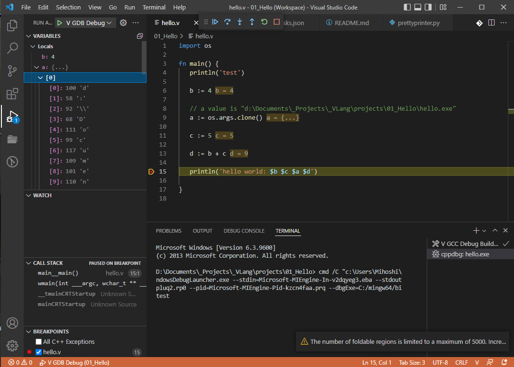

# V Hello

Minimal V project using VScode, Gcc and Gdb

## VSCode Installation & Setup of mingw

Follow the instructions on https://code.visualstudio.com/docs/cpp/config-mingw

However, instead of the MSYS2 mingw use the one from https://winlibs.com/  (I didn't try the one from https://www.mingw-w64.org/).
Install it in any folder (ie  C:\mingw64) and update your environment variable PATH to add `C:\mingw64\bin`.

## Install the `V language support'

In VS code search in the extension market for 'V' and install the V language support'.
As of this writing it is v0.1.13

## Download this Hello project

Downlowd this repository and install it anywhere

Launch `V-Hello.code-workspace`

Launch the `V GDB Debug` and you should see the image above

## Note

The three most important files are:

`.vscode/launch.json
.vscode/tasks.json
.vscode/prettyprinter.py`

launch.json contains the commands that you setup when compiling/debugging.
Before executing the command it will launch a task (if set) such as `"preLaunchTask": "V GCC Debug Build"`

tasks.json contains the tasks that the command can launch

Although a very good start, `prettyprinter.py` needs more work.
Also, if possible, I feel this file should be part of the 'V language support for vs code'

That's all folks!
Happy coding!
